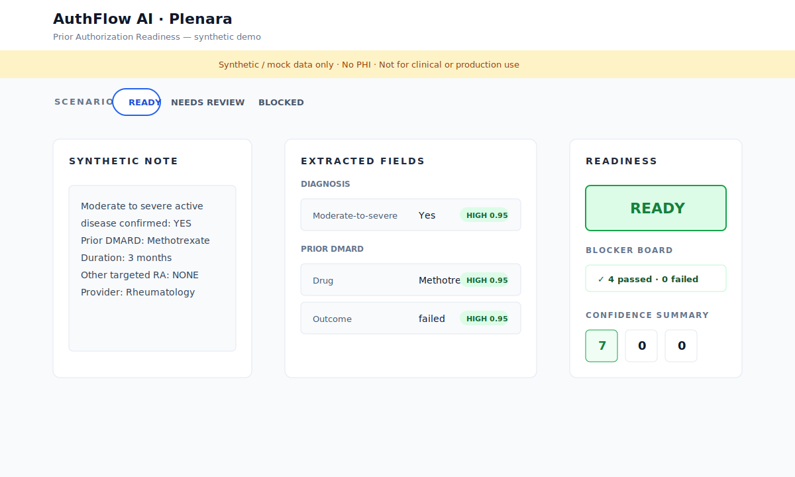
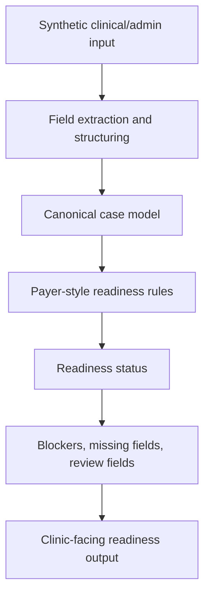

# Plenara — AuthFlow AI

**Prior authorization readiness, made explainable.**

Plenara (internal prototype name: **AuthFlow AI**) is a recruiter-safe public case study based on a private synthetic-data healthcare workflow prototype. The private prototype turns synthetic prior authorization inputs into structured readiness states, blockers, review fields, confidence signals, and clinic-facing outputs.

> Synthetic/mock data only. No PHI. No real patient data. Not for clinical or production use.  
> This case study does not approve, deny, or guarantee payer coverage.

---

## Demo milestone preview

The private prototype now includes a local FastAPI demo UI with three synthetic scenarios: **READY**, **NEEDS REVIEW**, and **BLOCKED**.



The visual demo shows the core workflow in one screen:

```text
Synthetic note excerpts → extracted fields + confidence chips → readiness status + blocker board
```

The public repository remains a safe portfolio case study. It does not include the full private codebase, API keys, production workflows, or real patient data.

---

## One-line summary

AuthFlow AI, externally positioned as **Plenara**, is a workflow automation prototype that turns unstructured prior authorization inputs into structured, readiness-aware outputs using Python, JSON-style contracts, rule-based validation logic, and explainable review states.

---

## Why this project exists

Specialty clinics often lose time before prior authorization submission because documentation requirements can be payer-specific, incomplete, or difficult to match against clinical notes.

This project explores a focused workflow question:

> Can a structured readiness layer help clinic teams catch missing documentation before a packet is submitted?

The goal is not to predict approvals. The goal is to support human review by making packet readiness clearer.

---

## Workflow architecture



The private development prototype currently expands this into:

```text
Synthetic input
  → extraction / provenance JSON
  → canonical mapping
  → rule-based readiness evaluation
  → READY / NEEDS REVIEW / BLOCKED
  → demo UI, API response, and Markdown report
```

---

## What this case study shows

This public repository is a focused case study based on a larger private development prototype. It demonstrates:

- Problem framing
- Workflow analysis
- Data structuring
- Readiness states
- Example synthetic output
- Real code excerpt from the readiness engine
- Safety boundaries for regulated-domain work
- Public portfolio communication for a private prototype

---

## Example readiness states

- `ready_for_submission`
- `needs_review`
- `blocked_missing_requirements`

In the demo UI, these map to clinic-facing labels:

- **READY** — synthetic blocker checks are satisfied
- **NEEDS REVIEW** — blockers may pass, but a critical field needs human review because confidence is low or uncertain
- **BLOCKED** — at least one required blocker fails and a coordinator should review the issue before submission

---

## Skills demonstrated

This project is designed to demonstrate practical skills relevant to Data Analyst, Data Quality, Operations Analyst, Business Analyst, Healthcare Operations, Workflow Automation, and AI workflow roles:

- Translating messy workflows into structured data models
- Designing validation and completeness checks
- Working with JSON-style outputs and schemas
- Implementing nested rule evaluation logic
- Building explainable readiness states instead of opaque AI answers
- Thinking through operational bottlenecks
- Documenting assumptions, risks, and limitations
- Building in a regulated-domain mindset without using sensitive data
- Communicating technical work clearly to non-technical stakeholders

---

## Repository structure

```text
code_excerpts/
  README.md
  readiness_engine_excerpt.py
docs/
  assets/
    demo-ready.svg
  portfolio_case_study.md
  future_demo_plan.md
sample_outputs/
  README.md
  readiness_response_sample.json
.gitignore
README.md
```

---

## Code excerpt

See:

```text
code_excerpts/readiness_engine_excerpt.py
```

This file contains a selected real excerpt from the private prototype readiness engine. It is shared to demonstrate implementation style, nested rule evaluation, blocker pass/fail logic, and readiness summary thinking without exposing the full private codebase.

---

## Sample output

See:

```text
sample_outputs/readiness_response_sample.json
```

Sample output preview: the file contains a complete synthetic response including readiness state, blocker counts, missing fields, review-required fields, confidence summary, and safety notice.

The sample shows a synthetic readiness response with:

- readiness status
- blocker counts
- missing fields
- review-required fields
- confidence summary
- safety notice

---

## Safety boundaries

This case study uses synthetic/mock data only. It does not handle PHI, process real patient records, submit to payers, predict approvals, replace clinical judgment, or represent production clinical software.

Any production healthcare implementation would require production-grade secure infrastructure under appropriate regulatory review, BAAs, encryption, access controls, audit logging, clinical/legal review, and human oversight.

---

## Current status

Public technical case study based on a private prototype. The goal of this repository is to communicate the problem, workflow design, implementation style, and output structure clearly while keeping private development artifacts separate.

Recent private-prototype milestone:

```text
FastAPI demo UI + three synthetic scenarios + README/screenshots packaging complete
```

---

## Future development

Planned improvements include:

- Additional recruiter-safe demo visuals
- Short demo walkthrough
- More synthetic readiness scenarios
- Public case study write-up explaining design decisions
- Clearer separation between private prototype code and public portfolio narrative
