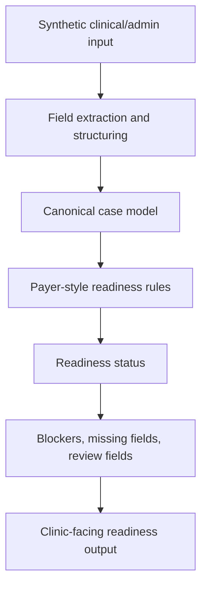

# AuthFlow AI / Plenara — Prior Authorization Readiness Workflow

A healthcare workflow automation case study showing how prior authorization inputs can be structured into readiness states, blockers, review fields, and clinic-facing outputs.

> Synthetic/mock data only. No PHI. No real patient data. Not for clinical or production use.

---

## One-line Summary

AuthFlow AI, externally positioned as **Plenara**, is a workflow automation prototype that turns unstructured prior authorization inputs into structured, readiness-aware outputs using Python, JSON-style contracts, rule-based validation logic, and explainable review states.

---

## Why This Project Exists

Specialty clinics often lose time before prior authorization submission because documentation requirements can be payer-specific, incomplete, or difficult to match against clinical notes.

This project explores a focused workflow question:

> Can a structured readiness layer help clinic teams catch missing documentation before a packet is submitted?

The goal is not to predict approvals. The goal is to support human review by making packet readiness clearer.

---

## Workflow Architecture



---

## What This Case Study Shows

This public repository is a focused case study based on a larger private development prototype. It demonstrates:

- Problem framing
- Workflow analysis
- Data structuring
- Readiness states
- Example synthetic output
- Real code excerpt from the readiness engine
- Safety boundaries for regulated-domain work
- Future demo roadmap

---

## Example Readiness States

- `ready_for_submission`
- `needs_review`
- `blocked_missing_requirements`

---

## Skills Demonstrated

This project is designed to demonstrate practical skills relevant to Data Analyst, Data Quality, Operations Analyst, Business Analyst, Healthcare Operations, and Workflow Automation roles:

- Translating messy workflows into structured data models
- Designing validation and completeness checks
- Working with JSON-style outputs and schemas
- Implementing nested rule evaluation logic
- Thinking through operational bottlenecks
- Documenting assumptions, risks, and limitations
- Building in a regulated-domain mindset without using sensitive data
- Communicating technical work clearly to non-technical stakeholders

---

## Repository Structure

```text
code_excerpts/
  README.md
  readiness_engine_excerpt.py
docs/
  portfolio_case_study.md
  future_demo_plan.md
sample_outputs/
  README.md
  readiness_response_sample.json
.gitignore
README.md
```

---

## Code Excerpt

See:

```text
code_excerpts/readiness_engine_excerpt.py
```

This file contains a selected real excerpt from the private prototype readiness engine. It is shared to demonstrate implementation style, nested rule evaluation, blocker pass/fail logic, and readiness summary thinking without exposing the full private codebase.

---

## Sample Output

See:

```text
sample_outputs/readiness_response_sample.json
```

Sample output preview: the file contains a complete synthetic response including readiness state, blocker counts, missing fields, review-required fields, confidence summary, and safety notice.

The sample shows a synthetic readiness response with:

- readiness status
- blocker counts
- missing fields
- review-required fields
- confidence summary
- safety notice

---

## Safety Boundaries

This case study uses synthetic/mock data only. It does not handle PHI, process real patient records, submit to payers, predict approvals, replace clinical judgment, or represent production clinical software.

Any production healthcare implementation would require HIPAA-compliant infrastructure, BAAs, encryption, access controls, audit logging, clinical/legal review, and human oversight.

---

## Current Status

Public technical case study based on a private prototype. The goal of this repository is to communicate the problem, workflow design, implementation style, and output structure clearly while keeping private development artifacts separate.

---

## Future Development

Planned improvements include a synthetic output screenshot, short demo walkthrough, lightweight mock UI or dashboard, and additional synthetic readiness scenarios.
