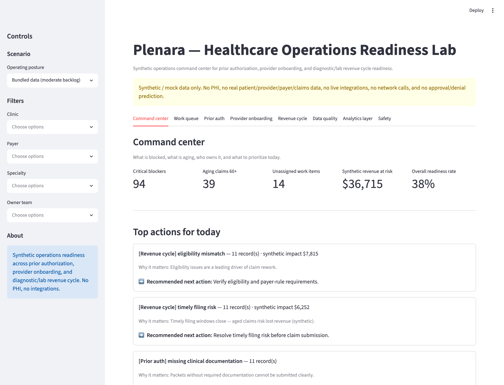
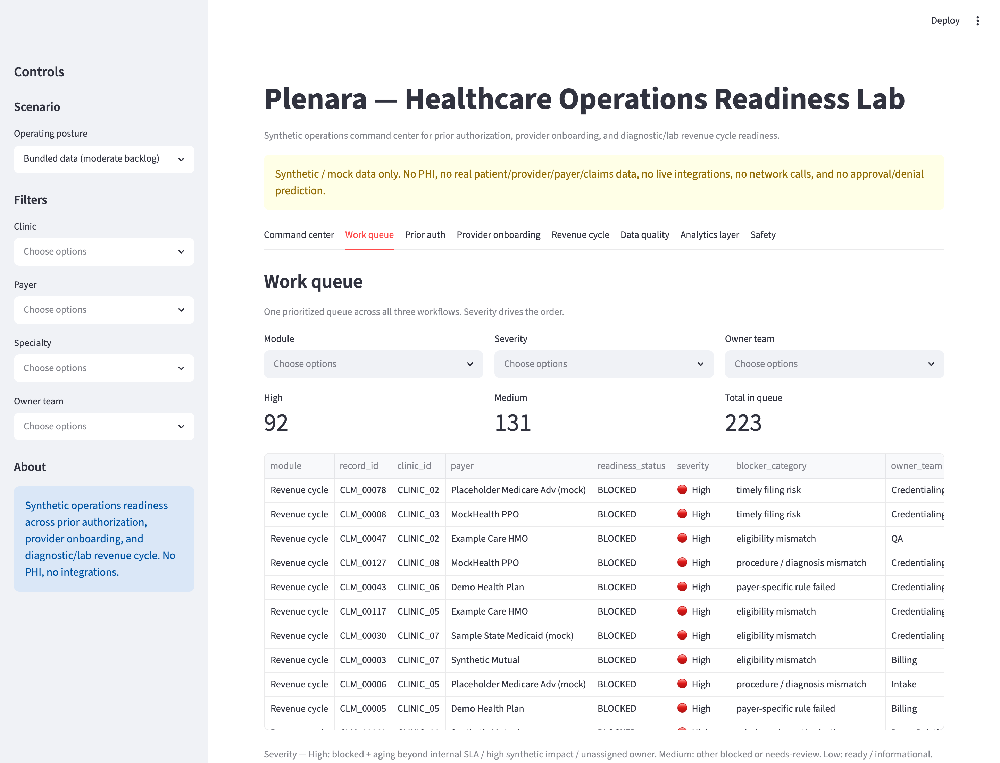
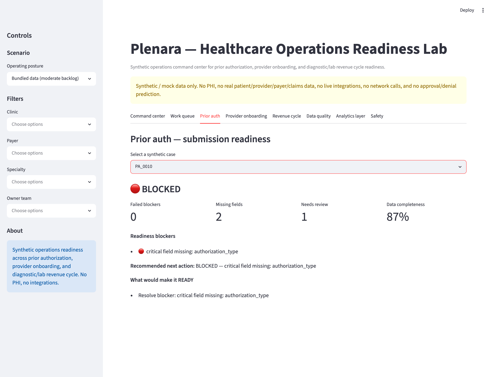
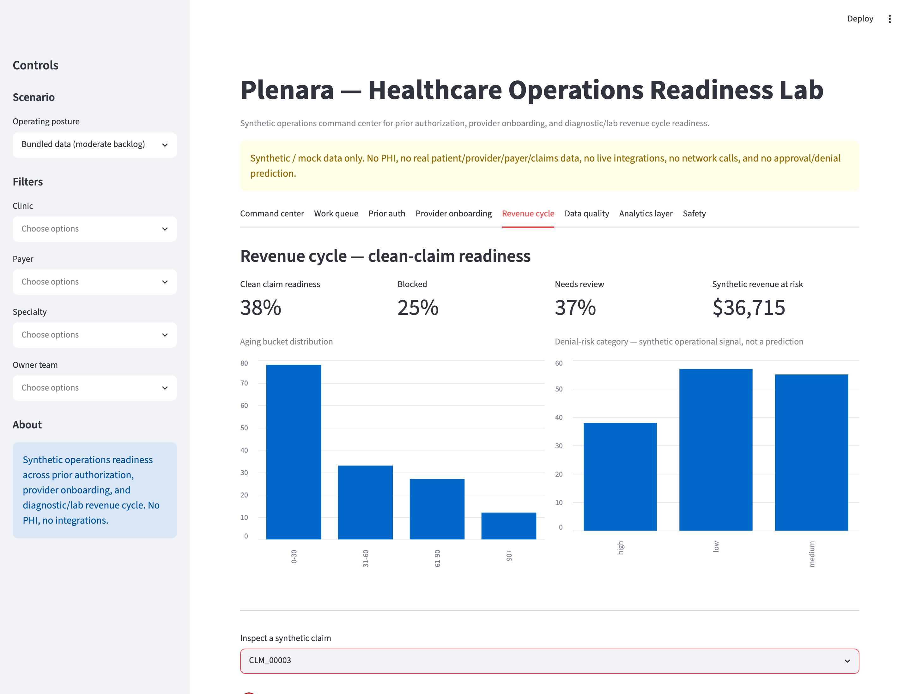
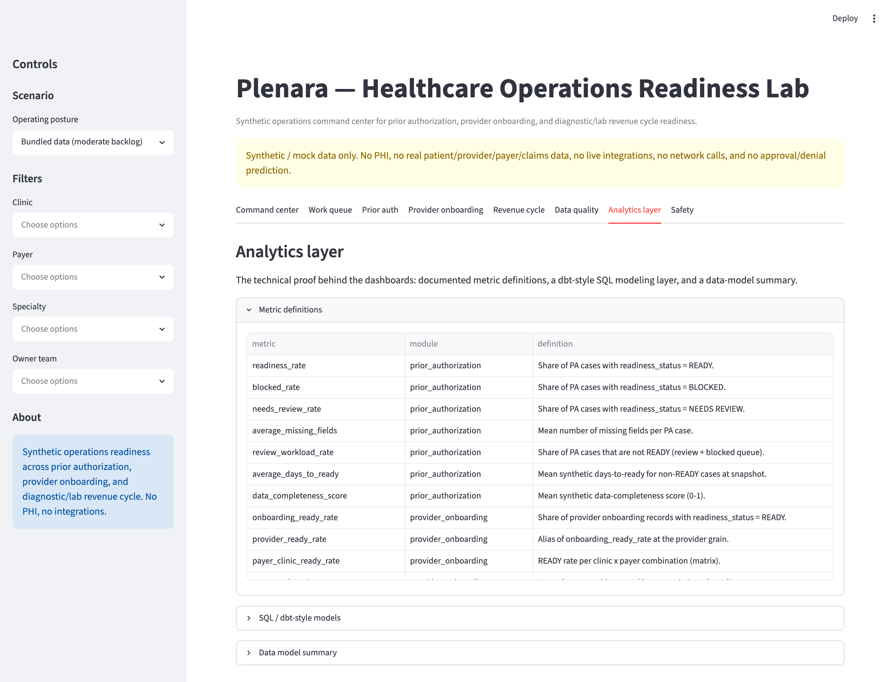

# Plenara — Healthcare Operations Readiness Lab

**Synthetic healthcare operations analytics for prior authorization readiness,
provider onboarding readiness, diagnostic/lab revenue cycle readiness, data
quality, metric definitions, and stakeholder reporting.**

> **Synthetic / mock data only. No PHI. No real patient, provider, payer, or
> claims data. Not production billing or clinical software.** Readiness states
> support human review — they are not approval/denial predictions and not
> clinical decisions. No live integrations and no network calls at runtime.

---

## What Plenara is

Plenara is a synthetic **healthcare operations analytics lab**. It demonstrates
how messy healthcare operations inputs can be turned into structured readiness
states, blockers, data-quality checks, metrics, dashboards, and
stakeholder-friendly reporting — using deterministic, explainable logic rather
than opaque scoring.

It is built as three operational wedges that share one readiness vocabulary
(**READY / NEEDS REVIEW / BLOCKED**) and one analytics layer:

1. **Prior Authorization Readiness** — is a synthetic PA packet complete enough to submit?
2. **Provider / Clinic / Insurance Onboarding Readiness** — is a synthetic provider-clinic-payer relationship ready for operational use?
3. **Diagnostic / Lab Revenue Cycle Readiness** — is a synthetic diagnostic/lab claim ready for clean submission?

## What problem it explores

Healthcare operations is rarely a single form — it is a fragmented workflow
across documentation, eligibility, payer rules, coding, credentialing, and
work-queue ownership. The question this lab explores:

> Can a structured, explainable readiness layer help operations teams catch
> missing, weak, or blocking issues **before** a packet, onboarding record, or
> claim moves forward — and turn that into clear metrics and reporting?

The goal is explainable workflow automation and stakeholder-friendly reporting,
with a regulated-domain safety mindset throughout.

## Live demo

**https://plenara-healthops.streamlit.app**

The app is offline-first and runs entirely on bundled synthetic data — no PHI,
no integrations, and no network calls at runtime. You can also
[run it locally](#how-to-run-locally).

## Product-style demo flow

The app is organized as an operations **command center**, not a generic
dashboard. It is built to answer, within about ten seconds: what is blocked, why,
who owns it, what to do next, what is aging, which workflow has the most friction,
and what the team should prioritize today.

- **Command center** — five headline KPIs (critical blockers, aging claims 60+,
  unassigned work items, synthetic revenue at risk, overall readiness rate) plus a
  prioritized **Top actions for today** list (module · issue · why it matters ·
  recommended next action · affected records · synthetic impact).
- **Unified work queue** — one prioritized queue across all three workflows with a
  severity, owner, age, blocker category, and a deterministic recommended action.
- **Module readiness views** — prior auth, provider onboarding, and revenue cycle,
  each showing status, blockers, recommended next action, and what would make a
  record READY.
- **Analytics layer** — metric definitions, the dbt-style SQL models, and a data
  model summary (the technical proof, kept below the operational views).
- **Safety** — synthetic-only boundaries stated plainly.

A sidebar **scenario** selector switches the synthetic operating posture
(stable operations, moderate backlog, high-friction payer environment, onboarding
surge, RCM cleanup queue).

## Domain calibration

The synthetic data is *designed* to feel credible to a prior authorization
manager, RCM/billing manager, clinic operations manager, or healthcare data
analyst — and to stay honest. Some clinics and payers carry more friction than
others, aging correlates with review/blocked states, synthetic revenue at risk
concentrates in aged blocked claims, and blocked items are always owned. The
numbers are **synthetic scenario design, not real benchmarks and not observed
impact**, and there are no real claims or payer data. Full notes, terminology,
KPI interpretation, and the "what would look suspicious to a real operator"
checklist are in [`docs/domain_calibration.md`](docs/domain_calibration.md).

---

## Core modules

### Prior Authorization Readiness
Evaluates synthetic PA cases into READY / NEEDS REVIEW / BLOCKED with missing
fields, failed blockers, review-required fields, confidence bands, a data
completeness score, and a synthetic case summary.

- **BLOCKED** — a payer-style blocker failed or a critical field is missing.
- **NEEDS REVIEW** — low/medium confidence, review-required fields, or low completeness.
- **READY** — checks pass and confidence/completeness are sufficient.

### Provider / Clinic / Insurance Onboarding Readiness
Models whether a synthetic provider-clinic-payer relationship is ready for
operational use: a clinic × payer readiness matrix, a provider readiness table,
a blocked-onboarding queue, top blocker categories, aging tasks, and readiness by
clinic and payer.

Example blockers: missing credentialing packet, payer contract not active,
directory not updated, missing license verification, stale CAQH attestation, NPI
mismatch, missing effective date, unassigned owner team, aging onboarding task.

### Diagnostic / Lab Revenue Cycle Readiness
Models whether a synthetic diagnostic/lab claim is ready for **clean submission**
or is blocked by eligibility, prior authorization, coding, documentation,
modifier, payer-rule, or timely-filing issues — with denial-risk categories,
aging work queues, owner-team workload, and a clearly synthetic revenue-at-risk
simulation.

- **clean-claim readiness** rate and blocked / needs-review rates
- **payer-rule blockers**, missing authorization, documentation gaps
- **denial-risk categories** (a synthetic operational signal — *not* a denial prediction)
- **aging work queues** by A/R bucket and owner team
- **revenue-at-risk simulation** (synthetic operations simulation — *not observed business impact*)

> No real claims, payer contracts, or reimbursement data are used anywhere.

---

## Product workflow

```text
Synthetic operations input  (PA case · onboarding record · diagnostic/lab claim)
        ↓
Structured fields + status signals  (eligibility, coding, credentialing, ...)
        ↓
Deterministic readiness engine  (plenara.readiness / provider_onboarding / claims_readiness)
        ↓
READY / NEEDS REVIEW / BLOCKED  + blockers, review reasons, missing fields
        ↓
Metrics + data-quality checks  →  dashboards + stakeholder reporting
```

## Demo preview

Plenara covers **three synthetic readiness workflows** — prior authorization
readiness, provider onboarding readiness, and revenue cycle / claim readiness —
each using the same explainable **READY / NEEDS REVIEW / BLOCKED** vocabulary.
The screenshots below are from the current Streamlit command-center UI on
synthetic data only.

| Command center | Work queue |
|---|---|
|  |  |
| Headline KPIs (critical blockers, aging claims, unassigned work, synthetic revenue at risk, overall readiness) plus prioritized **Top actions for today**. | One prioritized queue across all three workflows with severity, owner, age, and a recommended next action. |

| Prior authorization readiness | Revenue cycle readiness |
|---|---|
|  |  |
| A synthetic PA case showing **READY / NEEDS REVIEW / BLOCKED** status, readiness blockers, the recommended next action, and what would make it READY. | Clean-claim readiness, blocked / needs-review rates, aging buckets, denial-risk category (a synthetic operational signal, not a prediction), and synthetic revenue at risk. |

| Analytics layer |
|---|
|  |
| Metric definitions, the dbt-style SQL modeling layer, and a data-model summary — the technical proof behind the dashboards. |

> All screenshots use synthetic/mock data only — no PHI, no real patient,
> provider, payer, or claims data. The earlier prior-authorization previews
> remain under [`docs/assets/`](docs/assets) for reference.

---

## Data model

Three deterministic, seeded synthetic datasets live in [`data/`](data):

| Dataset | Rows | Grain |
|---|---|---|
| `synthetic_authorization_cases.csv` | 90 | one synthetic PA case |
| `synthetic_provider_onboarding.csv` | 120 | one synthetic provider-clinic-payer record |
| `synthetic_claim_readiness.csv` | 150 | one synthetic diagnostic/lab claim |

Every row is flagged `synthetic_only_flag = true`, contains no PHI-like columns,
and is regenerated by `python -m plenara.sample_data`. See [`data/README.md`](data/README.md)
for the full column dictionary.

## Analytics metrics

Metric definitions are documented in
[`analytics/metric_definitions.yml`](analytics/metric_definitions.yml) and
implemented in [`src/plenara/metrics.py`](src/plenara/metrics.py), including:

- `readiness_rate`, `blocked_rate`, `needs_review_rate`
- `average_missing_fields`, `average_days_to_ready`, `data_completeness_score`
- `onboarding_ready_rate`, `payer_clinic_ready_rate`, `aging_task_rate`
- `clean_claim_readiness_rate`, `blocked_claim_rate`, `needs_review_claim_rate`
- `denial_risk_distribution`, `revenue_at_risk_synthetic`, `aging_bucket_distribution`
- `workqueue_by_owner_team`, `top_claim_blocker_categories`

## SQL / dbt-style modeling layer

A modeling layer under [`analytics/sql/`](analytics/sql) mirrors a real
analytics-engineering workflow without connecting to a warehouse:

- **Staging** — `stg_authorization_cases`, `stg_provider_onboarding`, `stg_claim_readiness`
- **Fact** — `fct_authorization_readiness`, `fct_provider_onboarding_readiness`, `fct_claim_readiness`
  (each re-derives readiness in SQL and asserts it agrees with the Python engine)
- **Reporting marts** — `mart_healthops_client_reporting`, `mart_rcm_client_reporting`

## Python package structure

```text
src/plenara/
  __init__.py            # lightweight: version + canonical labels + evaluators
  readiness.py           # prior authorization readiness engine
  provider_onboarding.py # provider/clinic/payer onboarding readiness engine
  claims_readiness.py    # diagnostic/lab revenue cycle readiness engine
  scenarios.py           # synthetic operating-posture scenario profiles
  workqueue.py           # unified cross-module work queue + top actions
  metrics.py             # client-reporting metrics
  data_quality.py        # data-quality + synthetic-safety checks
  reporting.py           # command-center KPIs, explanations, work queues
  sample_data.py         # deterministic synthetic dataset generators + loaders
streamlit_app.py         # command-center multi-module app
analytics/               # metric_definitions.yml + sql/ modeling layer
data/                    # bundled synthetic CSVs + data dictionary
tests/                   # pytest suite
```

## Tests and CI

```bash
python -m pytest tests/ -q
```

The suite covers readiness rules for all three modules, metric calculations,
data-quality checks, synthetic-safety guarantees (no PHI-like columns, synthetic
flags, README safety language, no runtime network calls), the SQL layer, and a
Streamlit import smoke test. GitHub Actions runs the suite plus
`py_compile streamlit_app.py` on Python 3.11 and 3.12
(see [`.github/workflows/tests.yml`](.github/workflows/tests.yml)).

---

## Safety boundaries

- Synthetic / mock data only. No PHI, no real patient/provider/payer/claims data.
- No live integrations, no EHR or payer connections, no claims submission, no API keys, and no network calls at runtime.
- Readiness states support human review. They are **not** approval or denial predictions, not clinical decisions, and not medical recommendations.
- The `denial_risk_category` field is a synthetic operational signal derived from data-quality and payer-rule fields — not a prediction.
- Any ROI or revenue-at-risk figure is a **synthetic operations simulation — not observed business impact**, and not real reimbursement.

## Limitations

- Rules are intentionally simple and deterministic for explainability; they are not tuned to any real payer policy.
- Datasets are fabricated to exercise the dashboards, not to reflect real-world base rates.
- This is a demonstration of analytics, data quality, and workflow design — **not production healthcare software**. A production system would require secure infrastructure under regulatory review, BAAs, encryption in transit and at rest, role-based access control, audit logging, data retention controls, monitoring, clinical/legal review, and human oversight.

---

## How to run locally

```bash
# 1. Install dependencies
python -m pip install -r requirements.txt

# 2. (Optional) regenerate the synthetic datasets
PYTHONPATH=src python -m plenara.sample_data

# 3. Run the test suite
python -m pytest tests/ -q

# 4. Launch the dashboard
PYTHONPATH=src streamlit run streamlit_app.py
```

Then open the local URL Streamlit prints (default `http://localhost:8501`).
